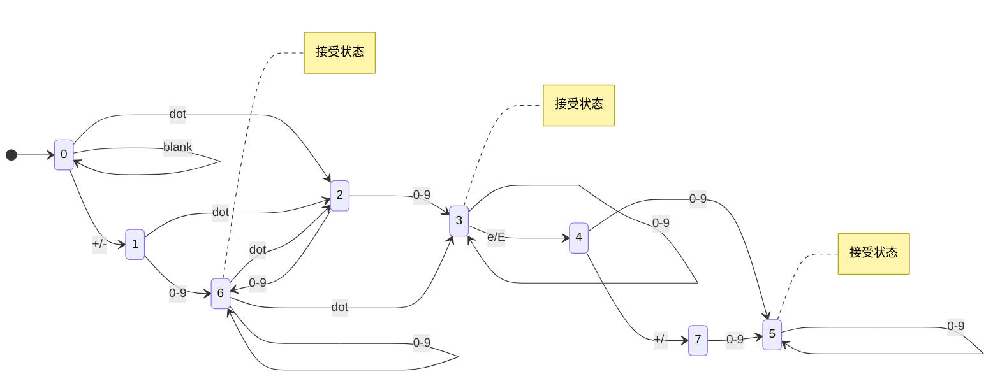

# 65. Valid Number

## 问题描述

Given a string `s`, return whether `s` is a **valid number**.

A **valid number** can be split up into these components
(in order):

1. A **decimal number** or an **integer**.
2. (Optional) An `'e'` or `'E'`, followed by an **integer**.

A **decimal number** can be split up into these components
(in order):

1. (Optional) A sign character (either `'+'` or `'-'`).
2. One of the following formats:
   - One or more digits, followed by a dot `'.'`.
   - One or more digits, followed by a dot `'.'`, followed by
     one or more digits.
   - A dot `'.'`, followed by one or more digits.

An **integer** can be split up into these components (in order):

1. (Optional) A sign character (either `'+'` or `'-'`).
2. One or more digits.

## 示例

**Example 1:**

```text
Input: s = "0"
Output: true
```

**Example 2:**

```text
Input: s = "e"
Output: false
```

**Example 3:**

```text
Input: s = "."
Output: false
```

**Example 4:**

```text
Input: s = "0.1"
Output: true
```

**Example 5:**

```text
Input: s = "2e10"
Output: true
```

**Example 6:**

```text
Input: s = "-90e3"
Output: true
```

**Example 7:**

```text
Input: s = "1 a"
Output: false
```

**Example 8:**

```text
Input: s = "abc"
Output: false
```

## 约束条件

- 1 <= s.length <= 20
- s consists of only English letters (both uppercase and lowercase),
  digits (0-9), plus '+', minus '-', or dot '.'

## 解法

### 方法1：Python内置函数（最简洁）

直接使用float()尝试转换，捕获异常。

```python
class Solution:
    def isNumber(self, s: str) -> bool:
        try:
            float(s)
            return True
        except ValueError:
            return False
```

### 方法2：有限状态机（DFA）

使用状态机严格按照规则验证。这个。。作为扩展了解一下吧，估计这辈子用不到。




```python
class Solution:
    def isNumber(self, s: str) -> bool:
        # 定义状态转移
        # 状态：0-初始，1-符号，2-整数，3-小数点，4-小数，5-e，6-e后符号，7-e后数字
        states = [
            # 0: 初始状态
            {'digit': 2, 'sign': 1, 'dot': 3},
            # 1: 符号后
            {'digit': 2, 'dot': 3},
            # 2: 整数部分
            {'digit': 2, 'dot': 4, 'exp': 5},
            # 3: 小数点（前面无数字）
            {'digit': 4},
            # 4: 小数部分
            {'digit': 4, 'exp': 5},
            # 5: e/E后
            {'sign': 6, 'digit': 7},
            # 6: e后符号
            {'digit': 7},
            # 7: e后数字
            {'digit': 7}
        ]

        # 合法的终止状态
        valid_end = {2, 4, 7}

        state = 0
        for char in s:
            if char.isdigit():
                char_type = 'digit'
            elif char in ['+', '-']:
                char_type = 'sign'
            elif char == '.':
                char_type = 'dot'
            elif char in ['e', 'E']:
                char_type = 'exp'
            else:
                return False

            if char_type not in states[state]:
                return False

            state = states[state][char_type]

        return state in valid_end
```

### 方法3：正则表达式

使用正则表达式匹配数字格式。

```python
import re

class Solution:
    def isNumber(self, s: str) -> bool:
        # 正则表达式解析：
        # [+-]? : 可选的符号
        # (\d+\.?\d*|\.\d+) : 整数或小数
        # ([eE][+-]?\d+)? : 可选的科学计数法
        pattern = r'^[+-]?(\d+\.?\d*|\.\d+)([eE][+-]?\d+)?$'
        return bool(re.match(pattern, s))
```

### 方法4：手动解析

逐字符检查，记录各种标志。

```python
class Solution:
    def isNumber(self, s: str) -> bool:
        seen_digit = False
        seen_exponent = False
        seen_dot = False

        for i, char in enumerate(s):
            if char.isdigit():
                seen_digit = True
            elif char in ['+', '-']:
                # 符号只能在开头或e/E后面
                if i > 0 and s[i-1] not in ['e', 'E']:
                    return False
            elif char in ['e', 'E']:
                # e前必须有数字，且不能重复
                if seen_exponent or not seen_digit:
                    return False
                seen_exponent = True
                seen_digit = False  # e后必须再有数字
            elif char == '.':
                # 小数点不能在e后，且不能重复
                if seen_dot or seen_exponent:
                    return False
                seen_dot = True
            else:
                return False

        return seen_digit
```

### 方法5: 模拟

字符串大模拟，根据「有效数字定义」梳理规则即可。

本题有多种解法：「正则」、「DFA」、「模拟」...

「模拟」是在各类场景中最容易实现的方式，只要头脑不发热都能写出来。

将字符串以 e/E 进行分割后，其实规则十分简单：

如果存在 e/E ：左侧可以「整数」或「浮点数」，右侧必须是「整数」
如果不存在 e/E ：整段可以是「整数」或「浮点数」
关键在于如何实现一个 check 函数用于判断「整数」或「浮点数」：

+/- 只能出现在头部
. 最多出现一次
至少存在一个数字

```java
class Solution {
    public boolean isNumber(String s) {
        int n = s.length();
        char[] cs = s.toCharArray();
        int idx = -1;
        for (int i = 0; i < n; i++) {
            if (cs[i] == 'e' || cs[i] == 'E') {
                if (idx == -1) idx = i;
                else return false;
            }
        }
        boolean ans = true;
        if (idx != -1) {
            ans &= check(cs, 0, idx - 1, false);
            ans &= check(cs, idx + 1, n - 1, true);
        } else {
            ans &= check(cs, 0, n - 1, false);
        }
        return ans;
    }
    boolean check(char[] cs, int start, int end, boolean mustInteger) {
        if (start > end) return false;
        if (cs[start] == '+' || cs[start] == '-') start++;
        boolean hasDot = false, hasNum = false;
        for (int i = start; i <= end; i++) {
            if (cs[i] == '.') {
                if (mustInteger || hasDot) return false;
                hasDot = true;
            } else if (cs[i] >= '0' && cs[i] <= '9') {
                hasNum = true;
            } else {
                return false;
            }
        }
        return hasNum;
    }
}
```

## 算法分析

### 复杂度分析

| 方法 | 时间复杂度 | 空间复杂度 | 说明 |
|------|-----------|-----------|------|
| Python内置 | O(n) | O(1) | float()内部解析 |
| 状态机 | O(n) | O(1) | 遍历一次 |
| 正则表达式 | O(n) | O(1) | 正则引擎匹配 |
| 手动解析 | O(n) | O(1) | 遍历一次 |

其中 n 是字符串长度。

### 有效数字的规则

一个有效的数字需要满足：

1. **基础格式：** `[符号] [数字部分] [e/E] [符号] [整数]`
2. **数字部分：** 可以是整数或小数
   - 整数：`123`, `+123`, `-123`
   - 小数：`1.23`, `.23`, `1.`, `+1.23`, `-1.23`
3. **科学计数法：** e/E后面必须是整数
   - `1e5`, `1.5e10`, `1.5e-10`, `.5e10`
4. **符号位置：** 只能在开头或e/E后面
5. **小数点：** 不能在e/E后面，不能重复

### 执行过程示例

以 s = "2e10" 为例（方法2：状态机）。

```text
初始：state = 0

字符 '2'：
  char_type = 'digit'
  states[0]['digit'] = 2
  state = 2

字符 'e'：
  char_type = 'exp'
  states[2]['exp'] = 5
  state = 5

字符 '1'：
  char_type = 'digit'
  states[5]['digit'] = 7
  state = 7

字符 '0'：
  char_type = 'digit'
  states[7]['digit'] = 7
  state = 7

最终：state = 7 in valid_end {2, 4, 7}
返回 True
```

以 s = "1 a" 为例。

```text
字符 '1'：digit, state = 2
字符 ' '：不在 ['digit', 'dot', 'exp'] 中
返回 False
```

## 常见错误

### 错误1：忘记处理空格

```python
# 错误：题目明确说明不包含空格（更新后的版本）
# 但如果题目允许前后空格
s = " 0.1 "
# 应该先 s.strip()
```

**注意：** 当前版本题目不包含空格，但早期版本可能有。

### 错误2：小数点规则理解错误

```python
# 错误理解：认为小数点两边必须都有数字
"." -> False ✅（两边都没有）
"1." -> True ✅（右边没有也可以）
".1" -> True ✅（左边没有也可以）
"1.1" -> True ✅
```

### 错误3：e后面的规则

```python
# 错误：允许e后面是小数
"1e10.5" -> False ✅（e后只能是整数）
"1e" -> False ✅（e后必须有数字）
"e10" -> False ✅（e前必须有数字）
"1e+10" -> True ✅（e后可以有符号）
```

### 错误4：符号位置判断

```python
# 符号只能在两个位置：
"123" -> True
"+123" -> True（开头）
"1+23" -> False（中间不行）
"1e+23" -> True（e后面可以）
"1e2+3" -> False（e后数字中间不行）
```

### 错误5：使用float()的边界情况

```python
# Python的float()比题目要求更宽松
float("inf") -> 有效（但题目要求False）
float("nan") -> 有效（但题目要求False）
float("infinity") -> 有效（但题目要求False）

# 如果使用方法1，需要额外检查
def isNumber(self, s: str) -> bool:
    try:
        num = float(s)
        # 排除特殊值
        return num != float('inf') and num != float('-inf')
    except ValueError:
        return False
```

## 相关题目

- [0008. String to Integer (atoi)](./008_string_to_integer.md)
- [0012. Integer to Roman](./012_integer_to_roman.md)
- [0013. Roman to Integer](./013_roman_to_integer.md)
- [1597. Build Binary Expression Tree From Infix Expression](./1597_build_binary_expression_tree_from_infix_expression.md)
- [0273. Integer to English Words](./273_integer_to_english_words.md)
