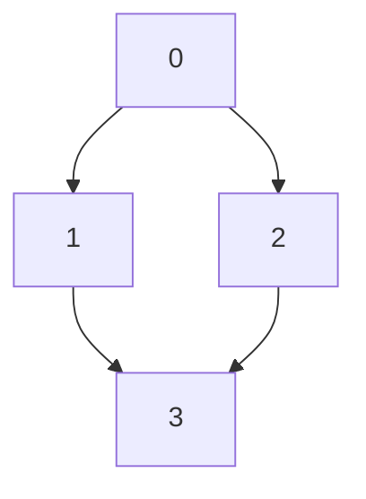
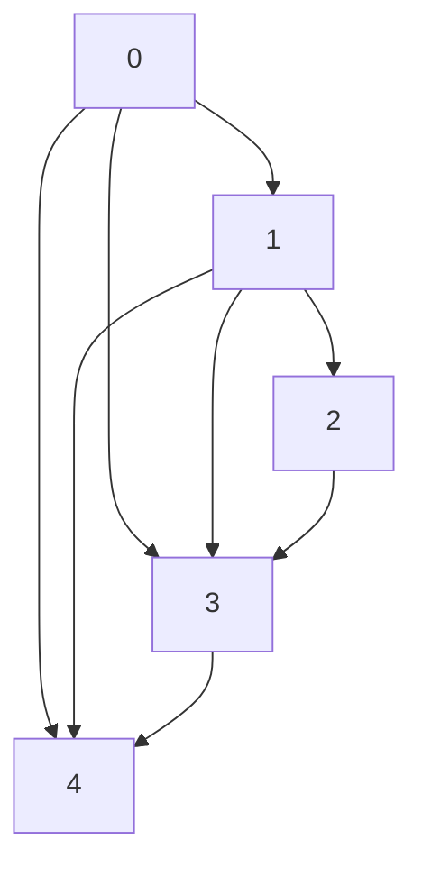

# All Paths From Source to Target

[[graph]]

Given a directed acyclic graph (DAG) of n nodes labeled from 0 to n - 1, find all possible paths from node 0 to node n - 1 and return them in any order.

The graph is given as follows: graph[i] is a list of all nodes you can visit from node i (i.e., there is a directed edge from node i to node graph[i][j]).

 

Example 1:




Input: graph = [[1,2],[3],[3],[]]
Output: [[0,1,3],[0,2,3]]
Explanation: There are two paths: 0 -> 1 -> 3 and 0 -> 2 -> 3.

Example 2:




Input: graph = [[4,3,1],[3,2,4],[3],[4],[]]
Output: [[0,4],[0,3,4],[0,1,3,4],[0,1,2,3,4],[0,1,4]]
 

Constraints:

n == graph.length
2 <= n <= 15
0 <= graph[i][j] < n
graph[i][j] != i (i.e., there will be no self-loops).
All the elements of graph[i] are unique.
The input graph is guaranteed to be a DAG.

memo + dfs:

```python
class Solution:
    def allPathsSourceTarget(self, graph: List[List[int]]) -> List[List[int]]:
        n = len(graph)

        @lru_cache(None)
        def dfs(node):
            if node == n - 1:
                return [[n - 1]]
            ans = []
            for nxt in graph[node]:
                for res in dfs(nxt):
                    ans.append([node] + res)
            return ans
        
        return dfs(0)
```

BFS:

```python
class Solution:
    def allPathsSourceTarget(self, graph: List[List[int]]) -> List[List[int]]:
        n = len(graph)
        q = deque([[0]])
        ans = []
        while q:
            path = q.popleft()
            if path[-1] == n - 1:
                ans.append(path)
                continue
            for v in graph[path[-1]]:
                q.append(path + [v])
        return ans
```

backtracking:

```python
class Solution:
    def allPathsSourceTarget(self, graph: List[List[int]]) -> List[List[int]]:
        n = len(graph)
        path = [0]
        ans = []
        
        def backtracking():
            if path[-1] == n - 1:
                ans.append(list(path))
            else:
                for nxt in graph[path[-1]]:
                    path.append(nxt)
                    backtracking()
                    path.pop()
        
        backtracking()
        return ans
```
