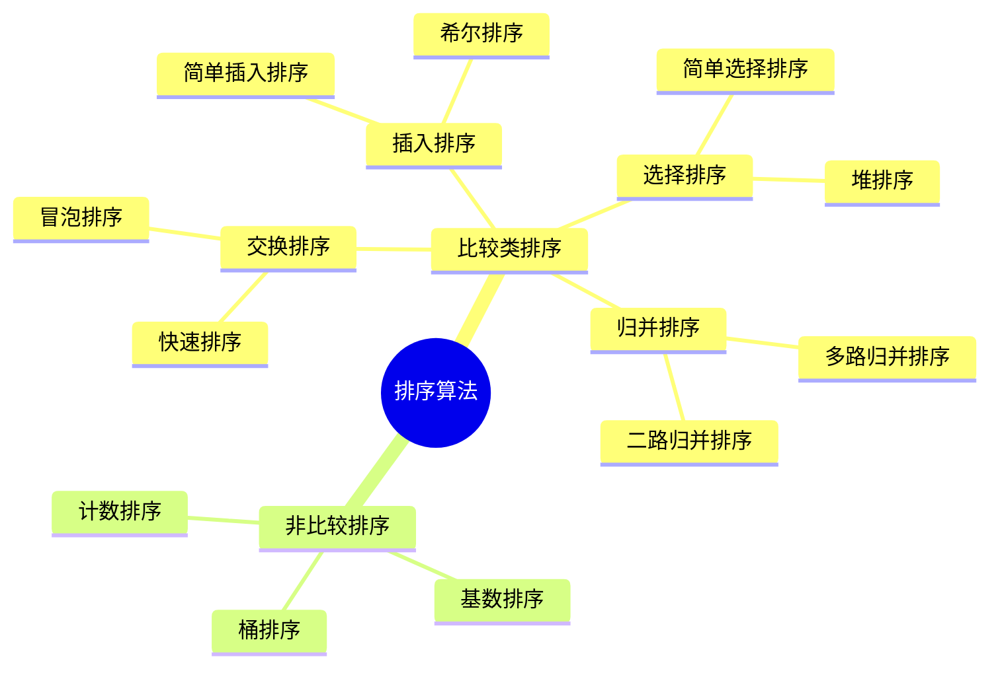

# sort

参考：<https://www.cnblogs.com/onepixel/p/7674659.html>

vscode 的插件对于 mermaid 的 mindmap 支持不是很好，可能无法正确渲染。建议使用在线的 mermaid 编辑器或者安装专门支持 mermaid 的插件来查看和编辑这个 mindmap。

一般而言，比较类排序算法的时间复杂度通常为 O(n log n)，而非比较类排序算法的时间复杂度可以达到 O(n)，但它们有特定的适用场景和限制条件。选择合适的排序算法取决于数据的特点和具体需求。

## 初级

都是 O(n^2) 的排序算法：

选择排序：每次从未排序的部分选择最小（或最大）的元素，放到已排序的末尾。
插入排序：从前往后逐步构建有序队列，对于未排序数据，在已排序序列中从后向前扫描，找到相应位置并插入。
冒泡排序：每次查看，如果是逆序，就交换

## 高级

快速排序：选取一个基准pivot，将数组分成两部分，一部分比pivot小，一部分比pivot大，然后递归地对这两部分进行排序。
归并排序：将数组分成两部分，分别排序后再合并。
堆排序：利用堆这种数据结构进行排序，通常使用大顶堆或小顶堆。

# 特殊

计数排序：适用于范围较小的整数排序，通过统计每个值出现的次数来进行排序。
桶排序：将元素分到不同的桶中，每个桶内使用其他排序算法进行排序，最后再将桶中的元素合并。
基数排序：按照位数将整数分成不同的数字，然后按每个位数分别进行排序，通常使用计数排序作为子排序算法。
